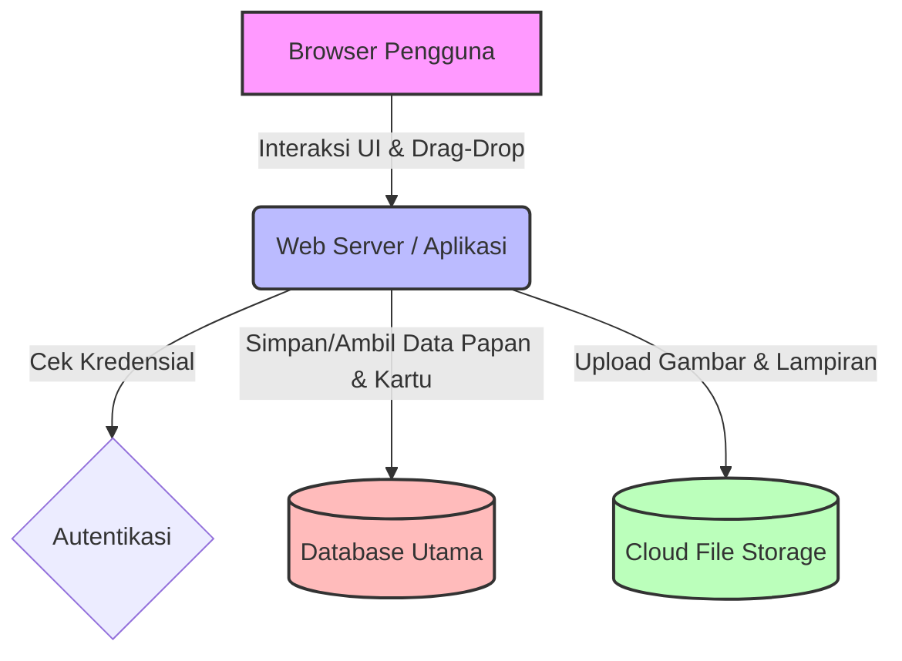
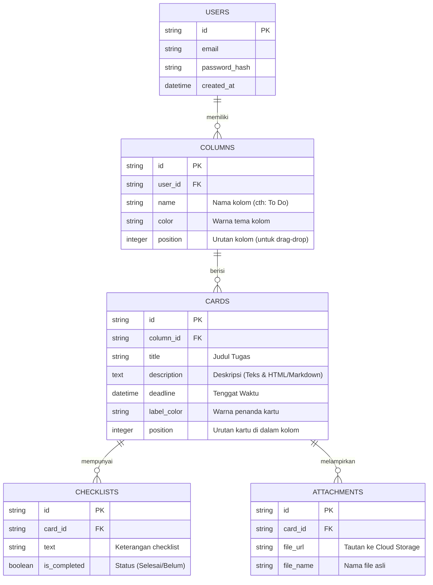

# PRD — Project Requirements Document

## 1. Overview
Aplikasi ini adalah sebuah platform manajemen tugas (To-Do List) berbasis web yang divisualisasikan dalam bentuk papan Kanban, mirip seperti Trello. Banyak orang kesulitan melacak pekerjaan dan tenggat waktu (deadline) mereka secara rapi. Aplikasi ini bertujuan menyelesaikan masalah tersebut dengan menyediakan antarmuka visual yang interaktif (drag-and-drop), di mana pengguna dapat dengan mudah memindahkan kartu tugas dari satu tahap ke tahap lainnya. Aplikasi ini dirancang khusus untuk penggunaan pribadi yang sederhana, rapi, dan sangat mudah disesuaikan (customizable).

## 2. Requirementscd /Users/mekari/fauzi/todolistlagi && npm run dev
- **Platform:** Aplikasi Berbasis Web (Web App).
- **Akses:** Bersifat tertutup (Private). Pengguna diwajibkan untuk membuat akun dan login untuk dapat melihat dan mengelola papan tugas mereka sendiri.
- **Audience:** Pengguna individu (solo user), tanpa fitur kolaborasi tim. Taksiran awal di bawah 100 pengguna aktif per bulan.
- **Interaksi Utama:** Interaksi halaman harus mulus dan dinamis tanpa perlu dimuat ulang (reload), terutama untuk fitur *drag-and-drop*.

## 3. Core Features
- **Autentikasi Pengguna:** Pendaftaran dan proses masuk (Login/Register) menggunakan Email dan kata sandi (Password).
- **Manajemen Kolom (Kategori Tugas):**
  - Kolom bawaan (default) saat pertama kali mendaftar: *To Do*, *In Progress*, *Done*.
  - Pengguna dapat mengganti nama kolom, menambahkan kolom baru, menghapus kolom, dan mengubah warna peringatan/header kolom.
- **Manajemen Kartu (Tugas):**
  - Membuat kartu tugas baru di dalam kolom tertentu.
  - Memindahkan kartu antar kolom menggunakan fitur *Drag-and-Drop*.
- **Detail Kartu (Card Details):**
  - **Deskripsi:** Mendukung teks dan penyisipan/unggahan gambar.
  - **Tenggat Waktu (Deadline):** Pemilihan tanggal dengan kalender, dilengkapi tombol jalan pintas (shortcut) untuk "Hari Ini" (Today) dan "Besok" (Tomorrow).
  - **Checklist:** Daftar sub-tugas yang bisa dicentang di dalam kartu.
  - **Lampiran File:** Pengguna dapat mengunggah file tambahan ke dalam kartu.
  - **Label/Warna:** Penanda visual berupa kotak warna atau label teks untuk mengategorikan tugas (misal: "Penting", "Bug", dll).

## 4. User Flow
1. **Registrasi/Login:** Pengguna membuka situs web dan masuk menggunakan Email & Password.
2. **Tinjauan Papan Papan (Board View):** Pengguna diarahkan ke papan tugas pribadi mereka yang sudah berisi 3 kolom default (*To Do*, *In Progress*, *Done*).
3. **Kustomisasi (Opsional):** Pengguna menambahkan kolom baru bernama "Review" dan memberinya warna biru.
4. **Pembuatan Tugas:** Pengguna menekan tombol "Tambah Kartu" di kolom *To Do*. Pengguna mengetik judul, menambahkan deskripsi berisi teks dan gambar, menekan pintasan deadline "Besok", dan menambahkan label warna merah.
5. **Eksekusi:** Saat mulai dikerjakan, pengguna menggeser (*drag*) kartu tersebut ke kolom *In Progress*.
6. **Penyelesaian:** Setelah selesai, pengguna menggeser kartu ke kolom *Done*.

## 5. Architecture
Aplikasi ini menggunakan arsitektur *Monolitik Modern* di mana tampilan (Frontend) dan logika server (Backend) dijalankan dalam satu kerangka kerja yang sama. Saat pengguna mengunggah file/gambar, file tersebut akan dikirim ke layanan penyimpanan awan (Cloud Storage), sementara data teks disimpan di Database utama.

## 6. Database Schema
Untuk mendukung fitur di atas, kita membutuhkan struktur basis data relasional sebagai berikut:

- **Users:** Menyimpan data pengguna yang terdaftar.
- **Columns:** Menyimpan daftar kolom milik spesifik pengguna beserta pengaturannya (warna, urutan).
- **Cards:** Menyimpan data tugas utama yang berada di dalam sebuah kolom.
- **Checklists:** Menyimpan item daftar centang yang terhubung ke sebuah kartu.
- **Attachments:** Menyimpan tautan ke file atau gambar yang diunggah khusus untuk sebuah kartu.

## 7. Tech Stack
Mengingat ini adalah proyek aplikasi web modern yang membutuhkan performa mulus untuk interaksi *drag-and-drop*, berikut adalah rekomendasi teknologi yang digunakan:

- **Framework (Frontend & Backend):** Next.js (Memberikan performa tinggi dan memudahkan pembuatan API dan antarmuka dalam satu tempat).
- **Desain & UI:** Tailwind CSS (untuk gaya visual cepat) dan shadcn/ui (untuk komponen siap pakai yang terlihat profesional). Pustaka tambahan seperti `dnd-kit` atau `hello-pangea/dnd` akan digunakan khusus untuk fitur *drag-and-drop*.
- **Database Utama:** SQLite (Sangat ringan, cepat, gratis, dan sangat memadai untuk target pengguna di bawah 100).
- **Alat Komunikasi Database (ORM):** Drizzle ORM (Mudah digunakan dan terintegrasi baik dengan TypeScript & SQLite).
- **Autentikasi Pembuka:** Better Auth (Sistem login yang modern, aman, dan mudah diatur untuk email/password).
- **Penyimpanan File/Gambar:** Uploadthing atau Amazon S3 (Untuk menyimpan gambar deskripsi dan file lampiran).